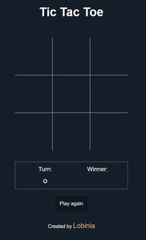

    

## Description

This is a TicTacToe game made in JavaScript.

The first turn player is selected randomly, and the current turn player gotta mark one spot, then it switches the player. The player who succeeds in placing three of their marks in a horizontal, vertical, or diagonal row is the winner. And its a considered a draw if the winning condition doesn't meet for any of the players when the last space is filled.

There are also win and draw sounds played when the game ends.